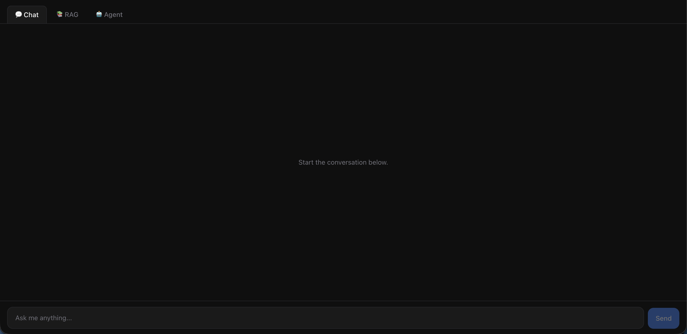

# 🧠 Nexus AI

> A full-stack AI application demonstrating three core LLM application patterns — streaming chat, retrieval-augmented generation (RAG), and tool-calling agents — in one production-shaped codebase.

[](DEMO_URL)




---

## ✨ Features

- 💬 **Chat mode** — streaming AI responses powered by Llama 3.3 70B via Groq
- 📚 **RAG mode** — upload documents, ask questions grounded in their content
- 🤖 **Agent mode** — an AI that decides when to call tools to answer a question
- ⚡ **Real-time streaming** — every response streams token-by-token over SSE
- 📊 **LangSmith monitoring** — every chat, RAG, and agent call is traced
- 🛡️ **Rate limiting & security** — per-IP rate limiting, CORS, centralized error handling

---

## 🛠️ Tech Stack

| Layer     | Technology                                    |
| --------- | ---------------------------------------------- |
| Frontend  | Next.js 14, TypeScript, Tailwind CSS            |
| Backend   | Node.js, Express, Groq API                      |
| Database  | Supabase PostgreSQL, pgvector                   |
| AI        | Llama 3.3 70B (via Groq), local embeddings (`@xenova/transformers`) |
| DevOps    | Railway, Vercel, Docker                         |
| Monitoring| LangSmith                                       |

---

## 🏗️ Architecture

```
┌───────────────────────┐         HTTPS / SSE           ┌────────────────────────────┐
│   Frontend (Vercel)    │ ─────────────────────────────▶│    Backend (Railway)        │
│   Next.js 14 + TS      │◀───────────────────────────── │    Express + Node 20        │
│                         │        streamed JSON events    │                              │
│  ModeSelector           │                                 │  routes/                    │
│  MessageList            │                                 │   ├─ chat.js   ─────────────┼──▶ Groq API
│  ChatInput              │                                 │   ├─ rag.js    ─────────────┼──▶ Groq API
│  DocumentUpload         │                                 │   └─ agent.js  ─────────────┼──▶ Groq API
│  StreamingMessage       │                                 │                              │
└─────────────────────────┘                                 │  services/                   │
                                                              │   ├─ groq.js                 │
                                                              │   ├─ embeddings.js  ─────────┼──▶ @xenova/transformers
                                                              │   └─ vectorSearch.js ────────┼──▶ Supabase (pgvector)
                                                              │                              │
                                                              │  every route wrapped in       │
                                                              │  LangSmith traceable()   ────┼──▶ LangSmith
                                                              └────────────────────────────┘
```

---

## 🚀 Getting Started

### Prerequisites

- Node.js 20+
- A [Supabase](https://supabase.com) project with the `vector` extension enabled
- A [Groq](https://console.groq.com) API key
- A [LangSmith](https://smith.langchain.com) API key

### Clone the repo

```bash
git clone https://github.com/petryk-dev/nexus-ai.git
cd nexus-ai
```

### Backend setup

```bash
cd backend
npm install
cp .env.example .env      # fill in GROQ_API_KEY, DATABASE_URL, LANGCHAIN_API_KEY
```

Run [`schema.sql`](backend/schema.sql) once against your Supabase database (SQL Editor or `psql`) — it enables `pgvector` and creates the `documents` table plus the `match_documents` similarity-search function.

```bash
node server.js             # http://localhost:8080
```

### Frontend setup

```bash
cd frontend
npm install
cp .env.example .env.local  # NEXT_PUBLIC_API_URL=http://localhost:8080
npm run dev                  # http://localhost:3000
```

Open **http://localhost:3000** — the backend must be running for any mode to work.

---

## 🔑 Environment Variables

### Backend (`backend/.env`)

| Variable                | Required | Description                                      |
| ------------------------ | :------: | ------------------------------------------------- |
| `PORT`                   |    –     | Server port (defaults to `8080`)                   |
| `FRONTEND_URL`           |    ✅    | Frontend origin allowed by CORS                    |
| `GROQ_API_KEY`           |    ✅    | Groq API key                                       |
| `GROQ_MODEL`             |    –     | Defaults to `llama-3.3-70b-versatile`               |
| `DATABASE_URL`           |    ✅    | Supabase Postgres connection string                |
| `LANGCHAIN_API_KEY`      |    ✅    | LangSmith API key                                  |
| `LANGCHAIN_TRACING_V2`   |    –     | Set `true` to enable tracing                       |
| `LANGCHAIN_PROJECT`      |    –     | LangSmith project name (defaults to `nexus-ai`)    |

### Frontend (`frontend/.env.local`)

| Variable                 | Required | Description                                 |
| -------------------------- | :------: | --------------------------------------------- |
| `NEXT_PUBLIC_API_URL`      |    ✅    | URL of the backend API                        |
| `NEXT_PUBLIC_SITE_URL`     |    –     | Deployed frontend URL, used to resolve `og:image` |

---

## 📦 Deployment

### Backend → Railway

1. Create a new Railway project pointing at this repo with a root directory of `backend`.
2. Railway builds via [`backend/Dockerfile`](backend/Dockerfile), configured by [`backend/railway.json`](backend/railway.json).
3. Set environment variables in the Railway dashboard: `GROQ_API_KEY`, `DATABASE_URL`, `LANGCHAIN_API_KEY`, `LANGCHAIN_TRACING_V2=true`, `LANGCHAIN_PROJECT=nexus-ai`, and `FRONTEND_URL` (your Vercel URL).
4. Note the generated Railway domain — you'll need it for `NEXT_PUBLIC_API_URL` on the frontend.

### Frontend → Vercel

1. Import the `frontend/` directory as a new Vercel project.
2. Set `NEXT_PUBLIC_API_URL` to your Railway backend URL and `NEXT_PUBLIC_SITE_URL` to your Vercel domain (wired in [`frontend/vercel.json`](frontend/vercel.json)).
3. Deploy. Once you have the Vercel URL, set it as `FRONTEND_URL` on the Railway backend so CORS allows requests from it.

---

## ⚙️ How It Works

**Chat** — The user's message and conversation history are sent to `/api/chat`, which forwards them to Groq's `llama-3.3-70b-versatile` with streaming enabled. Tokens are relayed to the client over Server-Sent Events as they arrive, and the full exchange is traced to LangSmith.

**RAG** — Uploaded text is split into 500-character chunks with 50-character overlap, embedded locally via `@xenova/transformers` (`all-MiniLM-L6-v2`, no API cost), and stored in Supabase as `pgvector` rows. A question is embedded the same way, matched against the top-3 most similar chunks by cosine similarity, and those chunks are injected as context into a Groq completion so the answer is grounded in the uploaded documents.

**Agent** — The user's message is sent to Groq along with three tool definitions (`getCurrentWeather`, `calculateDate`, `searchKnowledgeBase`). The model decides whether to call one or more tools; each call is executed server-side, its result is fed back into the conversation, and the loop repeats until the model responds with a final answer instead of another tool call — at which point the answer streams back to the UI.

---

## 📚 What I Learned

- Streaming LLM responses over Server-Sent Events between an Express backend and a React frontend
- Building a retrieval-augmented generation pipeline from scratch: chunking, local embeddings, and vector similarity search with `pgvector`
- Implementing a tool-calling agent loop (function calling) and surfacing tool usage live in the UI
- Instrumenting every LLM call with LangSmith tracing for observability
- Structuring a full-stack app for a real split deployment (Railway for the API, Vercel for the frontend) with proper CORS and environment configuration

---

## 👤 Author

**Volodymyr Petryk**

[LinkedIn](https://linkedin.com/in/volodymyr-petryk) · [petryk.developer@gmail.com](mailto:petryk.developer@gmail.com)
